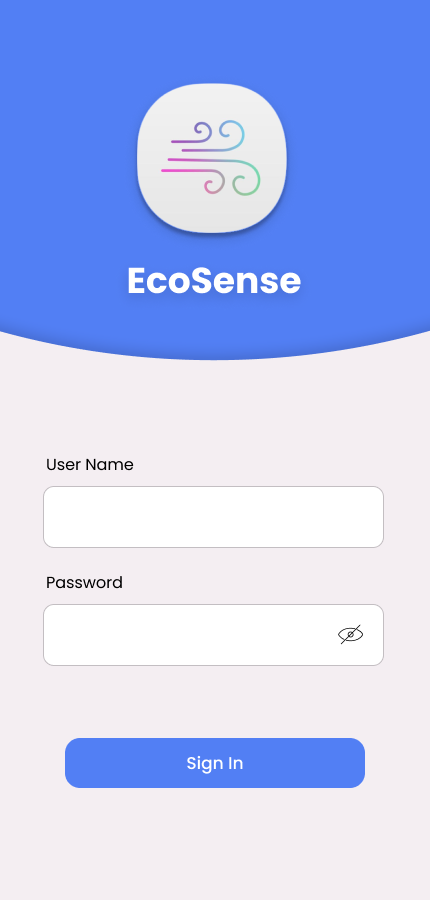
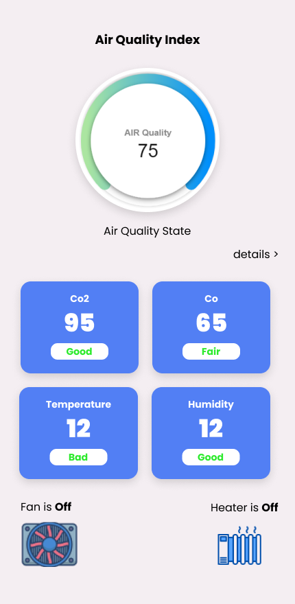
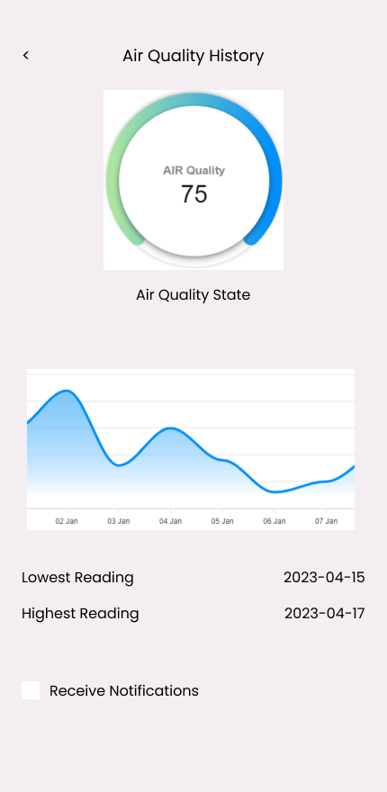
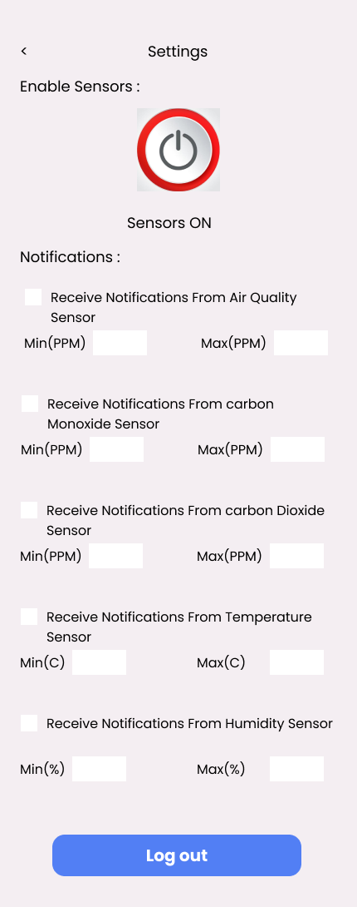
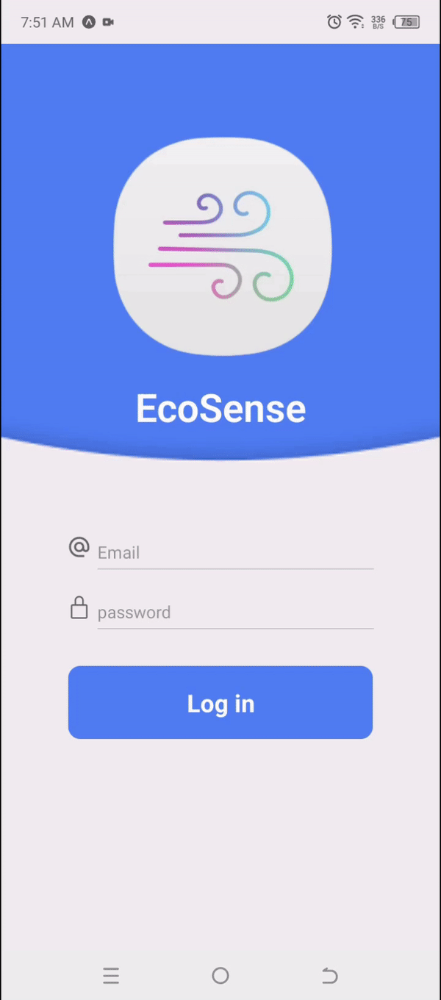
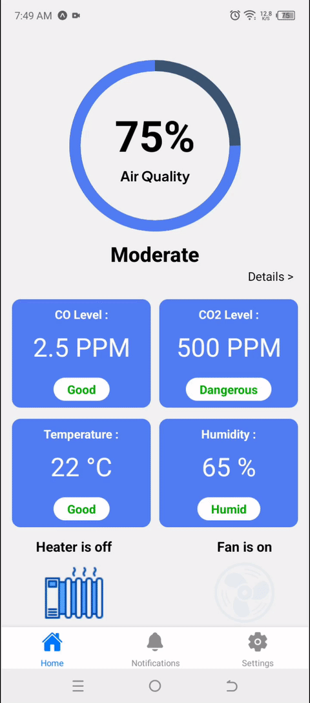
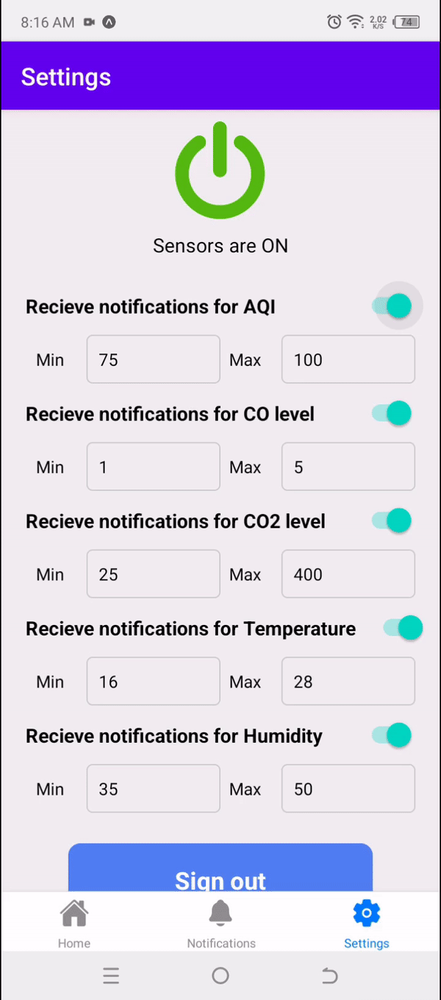
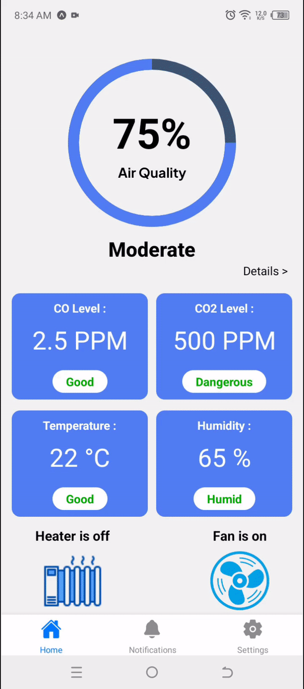
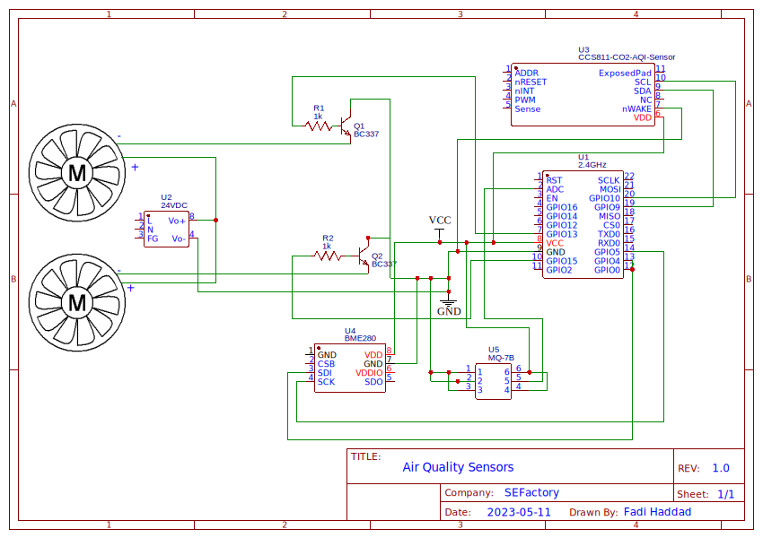

<br><br>

<!-- project philosophy -->


> EcoSense is a mobile app for real-time monitoring of indoor air quality, providing users with essential information about their environment. With EcoSense, users can easily track air variables such as air quality, carbon monoxide, carbon dioxide, temperature, and humidity. By providing up-to-date information, EcoSense empowers users to make informed decisions about their health and the environment around them.

### User Stories
- User Authentication and Access:<br>
As a user, I want to be able to log into the app with my credentials so that I can securely access my indoor air quality data and settings.
- Real-time Monitoring and Notifications:<br>
As a user, I want to be able to check the real-time readings of air quality, Carbon Monoxide, Carbon Dioxide, temperature, and humidity in my room. Additionally, I want to receive real-time updates and notifications on the levels of these parameters so that I can stay informed and take necessary actions if needed.
- Historical Data and Alert Management:<br>
As a user, I want to be able to view historical data on the air quality in my room to track changes over time and make informed decisions. Moreover, I want to set up alerts for specific thresholds related to air quality, Carbon Monoxide, Carbon Dioxide, temperature, and humidity. This way, I can proactively take action before the air quality reaches critical levels.

<br><br>

<!-- Prototyping -->


> We designed EcoSense using wireframes and mockups, iterating on the design until we reached the ideal layout for easy navigation and a seamless user experience.


### Mockups
| Login screen  | Home Screen | AQIHistory Screen| Settings Screen |
| ---| ---| ---| ---|
|  | |  |  |

<br><br>

<!-- Implementation -->


> Using the wireframes and mockups as a guide, we implemented the EcoSense app with the following features:

### User Screens (Mobile)
| Login screen  | AQIHistory screen | Settings screen | Settings screen |
| ---| ---| ---|---|
|  |  |  |  |

<br><br>
<br>


<br><br>

<!-- Tech stack -->


###  EcoSense is built using the following technologies:

- This project was built using [React Native](https://reactnative.dev/) and [Expo](https://docs.expo.dev/) Cross-Platform Mobile Development tools. Expo is a framework to build React Native apps. It is a set with tools and services built for React Native.
- The backend of the app uses [Express](https://expressjs.com/), the [Node.js](https://nodejs.org/) web application framework. Express is a minimal and flexible Node.js web application framework that provides a robust set of features for web and mobile applications.
- For storage (database), the app uses [MongoDB ](https://www.mongodb.com/), a flexible and scalable noSQL timeseries database that stores data in JSON-like documents.
- For hardware programming, the [ESP8266](https://arduino.esp8266.com/) microcontroller and [Arduino IDE](https://www.arduino.cc/) were used to collect data from sensors and software development. The ESP8266 connects to Wi-Fi and sends the data to the database for storage, allowing for real-time monitoring of indoor air quality through our EcoSense mobile app.
<br><br>

<!-- How to run -->


> To set up EcoSense locally, follow these steps:

### Prerequisites

- Download and install [Node.js](https://nodejs.org/en/)

- Download and install [MongoDB](https://www.mongodb.com/docs/manual/installation/)

- Expo CLI
  ```sh
  npm install --global expo-cli
  ```
- Download the [Expo Go](https://expo.dev/client) mobile app from the app store.
- Download the [Arduino IDE](https://www.arduino.cc/).


### Installation

1. Clone the repo
   ```sh
   git clone https://github.com/fadi-haddad/EcoSense.git
   ```
2. Navigate to the frontend folder and install dependencies
   ```sh
   cd EcoSense-mobile/EcoSense
   npm install
   ```
3. Navigate to the backend folder and install dependencies
   ```sh
   cd EcoSense-server
   npm install
   ```
4. Go to "config.example.js" file in the EcoSense-server folder, Rename it to 'config.js' and follow the instructions inside to replace the PORT number, URI and the JWT secret key.
5. Go to "secrets.example.h" file in the EcoSense-server/Arduino folder, Rename it to 'secrets.h' and follow the instructions inside to replace the ssid, password, saveURL, postURL to match your wifi credentials and computer's ip address.
6. On Arduino IDE: go to File > Preferences > Borad manager> enter "http://arduino.esp8266.com/stable/package_esp8266com_index.json" and click OK.
7. Go to Tools > Board > Board Manager, search for "esp8266", and install the "esp8266" board package.
8. Go to Tools > Board > ESP8266 and choose 'Generic ESP8266 Module',
9. Go to Tools > PORT and choose the available COM PORT.
10. Go to Sketch> Include Library > Manage Libraries and install these Packages: (ESP8266WiFi, WiFiClient, ESP8266HTTPClient, Adafruit_Sensor, Adafruit_BME280, Adafruit_CCS811, ArduinoJson).
11. Connect the ESP8266 to your computer using a USB cable, upload the code inside main.cpp in the EcoSense-server/arduino directory to the ESP8266.
12. Prepare the elements you will need to assemble the circuit, you will need the following: 
   - Sesnors: (BME280, CCS811 and MQ-7),
   - 2* BC337 transistors,
   - 2* 1K ohm resistors,
   - 2* 24VDC fans.
13. Follow the circuit diagram to wire the ESP8266 controller with other elements on the borad.
14. Navigate to EcoSense-Mobile and run the start up command :
   ```sh
   npm run web
   ```
15. Scan the generated QR code in the terminal with your camera (ios) or through the Expo Go application (android), now you should be able to run EcoSense locally and explore its features.
